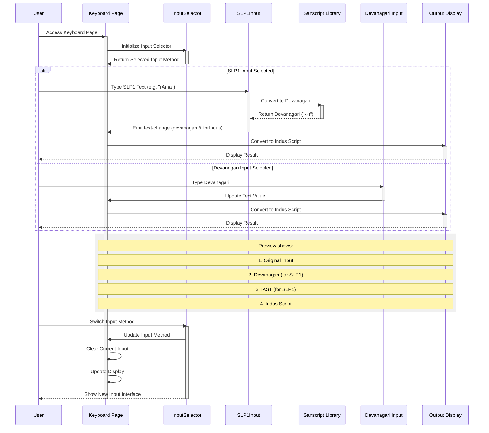

## Sequence Diagram

The updated sequence diagram shows:

1. Initial Flow:
- User accesses the keyboard page
- Page initializes with InputSelector component
- Selected input method is loaded

2. SLP1 Input Path:
- User types in SLP1 format
- Text is converted to Devanagari using Sanscript library
- Converted text is emitted with both devanagari and forIndus properties
- Text is displayed in Indus script

3. Devanagari Input Path:
- User types directly in Devanagari
- Text is updated in keyboard component
- Text is converted to Indus script
- Result is displayed

4. Preview Features:
- Shows original input
- Shows Devanagari conversion (for SLP1)
- Shows IAST transliteration (for SLP1)
- Shows final Indus script output

5. Input Method Switching:
- User can switch between input methods
- Current input is cleared
- Interface updates to show appropriate input component
- State is preserved in localStorage

This diagram better reflects the current implementation with both input methods and the preview functionality. 

