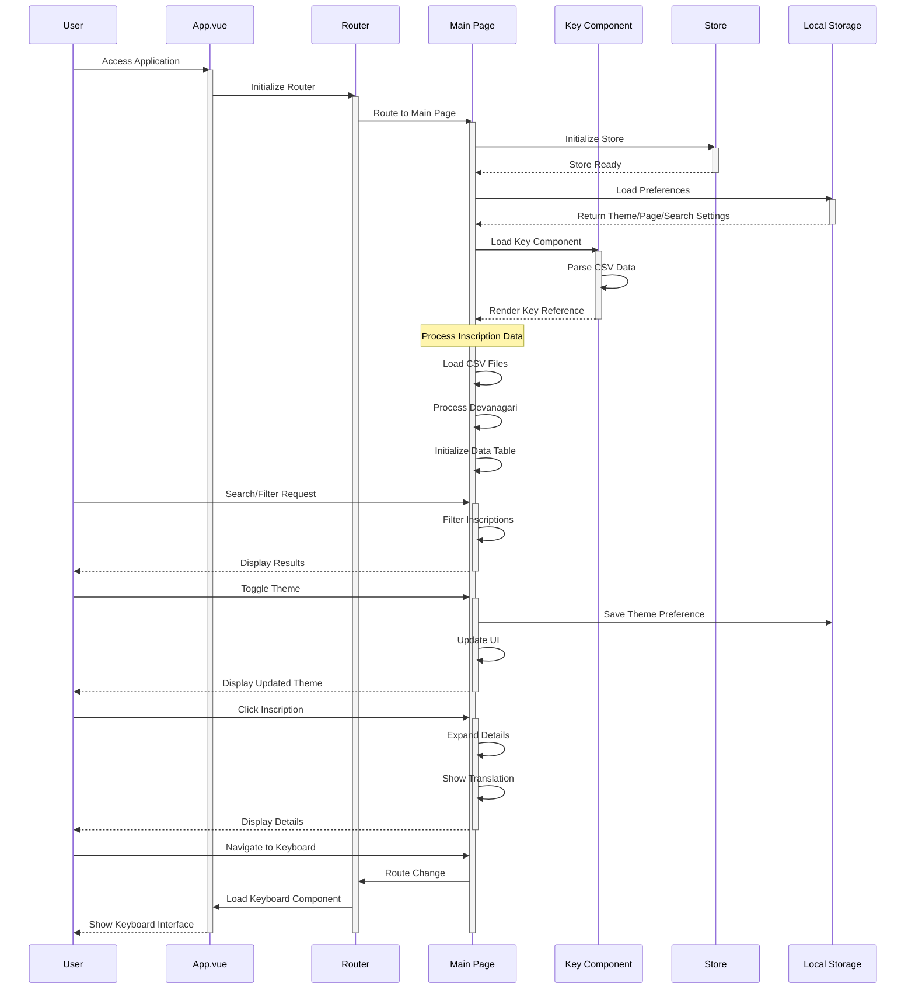

Here is  the  sequence diagram to show the main interactions in this Vue.js application. I'll focus on the core user interactions and data flow.

I've created a sequence diagram showing the main interactions in the application. Here's what it illustrates:

1. Initial Application Load:
- User accesses the application
- App.vue initializes and sets up the router
- Main page loads and initializes the store
- Preferences are loaded from local storage
- Key component loads and processes CSV data

2. Main User Interactions:
- Search/Filter functionality
- Theme toggling with persistence
- Inscription detail viewing
- Navigation between components

3. Data Flow:
- CSV data processing
- Local storage interactions
- Component communication
- Router navigation

4. Key Components:
- App.vue as the main entry point
- Router for navigation
- Main page handling core functionality
- Key component for reference data
- Store for state management
- Local Storage for persistence

The diagram shows both synchronous and asynchronous operations, with activations indicating when components are actively processing. Notes help clarify complex operations like inscription data processing.

